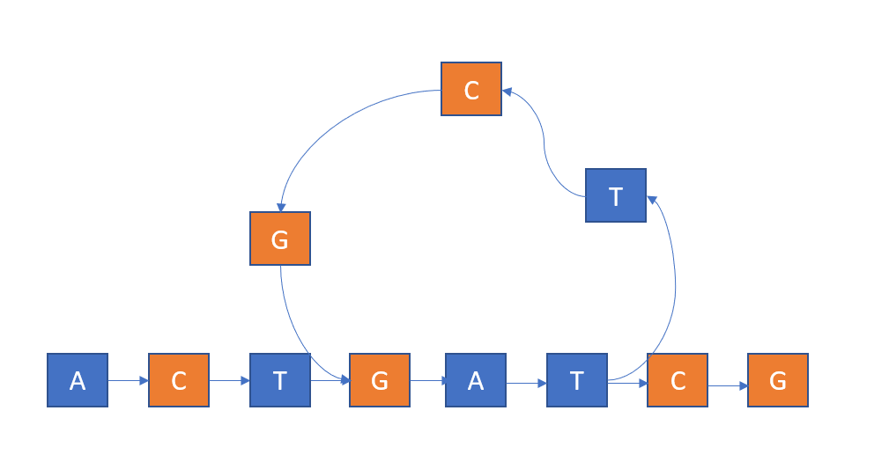

[TOC]

# 宏基因组组装PJ

胡志峰 16307130177

## 方法

使用De Brujin Graph来组装。只利用短串，首先通过反转、取补的操作扩充成更大的短串集合。然后对于每个短串将其打碎成kmer，基于这些kmer来构建De Bruijin Graph。

构建好DBG之后，我分析了该图的形态。首先知道对于DBG中的节点来说，其入度和出度至多为4。考虑以下的度数情况

1. 入度或者出度为0，该节点为基因的起点或者终点
2. 入度和出度都为1，该节点为基因路径上的一段
3. 入度或者出度大于等于2，该节点为某个分支的开始或者结束

对于情况1和3都很好理解，而情况3则较为复杂。分析产生分支的原因有一下几点

### 测序错误

由于某个短串在该位置测序错误，导致路径分裂了出去。我们需要把这部分分支路径合并回主要路径。我考虑了用以下条件来判断这个情况

1. 两个分支中的一个经过次数明显小于另一个。因为错误发生导致的分支经过次数会明显小于正常的分支

   ```
   if ((double)x->cvg / y->cvg < 0.7) {
   ```

2. 从两个分支一直往下走直到第一个入度大于1的点相同，并且分支的长度足够长

   ```
   walkThroughBubble(x->node, xpath);
   walkThroughBubble(y->node, ypath);
   ```

   

当上述两个条件满足时删除经过次数低的那个分支即可。

### 环

众所周知，基因中有大量的重复片段[^6]。这导致不可避免地在DBG图上出现环



如上图所示，如果我们不考虑环，则基因路径为ACTGATCG，但是考虑到环的存在，我们会读出ACTGATTCGGATCG。因此我们需要找出DBG中的环。我修改了Tarjar的强连通分量算法，使用深度优先搜索标注出了图中指向的环的分支，在输出的时候优先走带环的分支。

### 输出

在考虑完上述的情况后，DBG中便几乎不存在出度或者入度大于1的节点，因此可以开始输出。根据上述优先走环的方法，我们额外考虑逐步输出最长串的方法——迭代地通过深度优先搜索找到最长路径，输出后删除。为了降低覆盖率考虑只输出长度足够长的串。

## 程序说明

我使用git来管理代码，因此可以通过检查git log来证明PJ的完成过程。代码将在PJ截止后公开，可以通过[dna-assembly-cpp](<https://github.com/ichn-hu/dna-assembly-cpp>)访问。

使用面向对象的方法完成程序。主要实现了`Genome`对象用来处理基本的字符串输入输出；`DBGNode`对象来表示De Brujin图中的节点，`DBGEdge`来表示图中的边，`DeBrujinGraph`来表示图。

## 参考资料

[^1]: De Bruijn graph <https://en.wikipedia.org/wiki/De_Bruijn_graph>
[^2]: De novo sequence assemblers <https://en.wikipedia.org/wiki/De_novo_sequence_assemblers>
[^3]: 字符串相似度之美（一）<https://zhuanlan.zhihu.com/p/20101194>
[^4]: <https://zhuanlan.zhihu.com/p/20102352>
[^5]: Approximate string matching <https://en.wikipedia.org/wiki/Approximate_string_matching#endnote_CRMN01>
[^6]: <https://en.wikipedia.org/wiki/Repeated_sequence_(DNA)>


## 其他

mailto: wanjunpeng@foxmail.com